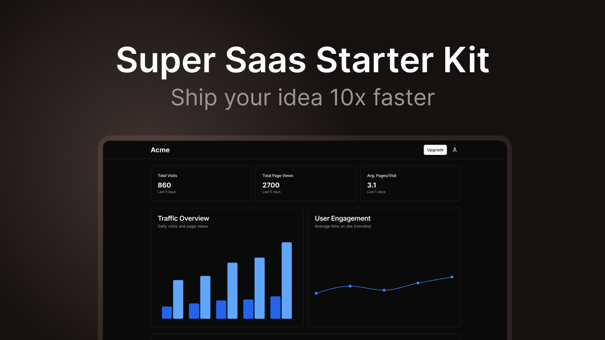

# 🚀 Modern SaaS Starter Kit

[](https://choosealicense.com/licenses/mit/) [](https://nextjs.org/) [](https://www.typescriptlang.org/) [](https://tailwindcss.com/) [](https://supabase.com/)  [](https://turborepo.org/)

A production-ready, feature-rich SaaS starter kit built with the latest web technologies. Launch your SaaS product in days, not months.



## ✨ Features

- 🏗️ **Rock-solid Foundation**

  - [Next.js 15](https://nextjs.org/) with App Router & Server Components
  - [TypeScript](https://www.typescriptlang.org/) for type safety
  - [Turborepo](https://turborepo.org/) monorepo setup with multi-zone architecture
  - Secure by default (protected against CVE-2025-29927)

- 💅 **Beautiful UI & UX**

  - [Tailwind CSS](https://tailwindcss.com/) for styling
  - [Radix UI](https://www.radix-ui.com/) & [shadcn/ui](https://ui.shadcn.com/) for accessible components
  - Dark mode support out of the box
  - [Lucide](https://lucide.dev/) icons
  - [Sonner](https://sonner.emilkowal.ski/) for beautiful toast notifications

- 🔥 **Battle-tested Stack**

  - [Supabase](https://supabase.com/) for authentication & database
  - [Update](https://update.dev) for easy billing and auth
  - [SWR](https://swr.vercel.app/) for data fetching
  - [PostHog](https://posthog.com/) for analytics

- 🗺️ **Multi-zone architecture**

  The landing page and dashboard are separate Nextjs apps, but they share the same URL. You can access localhost:3000 for the landing page and localhost:3000/dashboard for the dashboard. This makes it easy to separate logic and code for the landing page and dashboard.

- 🛠️ **Developer Experience**
  - ESLint configuration for code quality
  - Shared component library
  - Hot reload & Fast Refresh

## 🚀 Quick Start

1. Clone the repository

```bash
git clone https://github.com/EmmettM/super-saas-template.git
cd saas-starter-kit
```

2. Install dependencies

```bash
pnpm install
```

3. Set up environment variables

```bash
cp .env.example .env
```

4. Start the development server

```bash
pnpm dev
```

## 🌟 Why This Starter Kit?

- **Production-Ready**: Built with scalability in mind
- **Modern Stack**: Uses the latest stable versions of all dependencies
- **Type-Safe**: Full TypeScript support across the entire codebase
- **Best Practices**: Follows industry standards and security best practices
- **Fully Featured**: Includes everything you need to launch a SaaS product

## 📦 What's Included

- Landing page template
- Dashboard application
- Authentication system
- Subscription management
- Admin panel
- Error tracking
- Analytics integration

## 🤝 Contributing

Contributions are always welcome! Please read our [contributing guidelines](CONTRIBUTING.md) first.

## 📦 Project Structure

```
├── apps/                  # Applications
│   ├── dashboard/         # Dashboard application
│   │   ├── app/           # Next.js app directory
│   │   ├── components/    # Dashboard-specific components
│   │   └── public/        # Static assets
│   └── www/               # Landing page application
│       ├── app/           # Next.js app directory
│       ├── components/    # Landing page components
│       └── public/        # Static assets
├── packages/              # Shared packages
│   ├── ui/                # Shared UI components
│   │   ├── components/    # Reusable components
│   │   └── styles/        # Shared styles
│   ├── utils/             # Shared utilities
│   └── eslint/            # ESLint configuration
├── turbo.json             # Turborepo configuration
└── package.json           # Root package.json
```

## 🎨 Tailwind Configuration

The template includes a comprehensive Tailwind configuration with:

- **Custom Colors**: Extended color palette for branding
- **Dark Mode**: Automatic dark mode support with system preference
- **Animations**: Custom keyframes and transitions
- **Typography**: Custom font families and text styles
- **Spacing**: Extended spacing scale
- **Components**: Pre-configured component classes

## 🚀 Deploy

[](https://vercel.com/new/clone?repository-url=https://github.com/EmmettM/super-saas-template)

## 📝 License

This project is licensed under the MIT License - see the [LICENSE](LICENSE) file for details.

## 💪 Support

If you like this project, please consider giving it a ⭐️. It helps others discover this resource.

For issues, feature requests, or questions, please [open an issue](https://github.com/EmmettM/super-saas-template/issues).

---

Built with ❤️ by [Emmett Miller](https://github.com/EmmettM)
